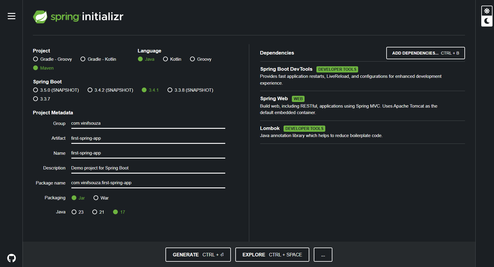

###### Questions

- [ ] What is Tomcat for?
- [ ] Read about Autowired
- [ ] What is Bean's 
	- for use Autowired on external classes?
	- create external classes instances?
	- singleton

### Spring vs Spring Boot

Spring and Spring Boot are both Java frameworks used to develop web applications. Spring is a lightweight framework that provides a comprehensive programming and configuration model. Spring Boot is an extension of Spring that simplifies the configuration and deployment of Spring applications.

### Spring Initializr
Initializr generates spring boot project with just what you need to start quickly!
https://start.spring.io/

### App Structure

#### .mvn
Maven configurations.

#### **pom.xml**
POM is an XML file that contains the project configuration details used by Maven. It provides all the configurations required for a project.

**POM** means **Project Object Model**, and, as the name suggests, it defines the model of the project as well.

In the normal project development you will add JAR files and libraries as required. In **Maven-based** development, those JAR files, libraries are added to the project using this **pom.xml**. In the pom context we call those **JAR files, libraries as dependencies**.

#### src

- **main**
	- java - Application entrypoint
	- resources - Used to store non-code resources that your application needs at runtime. These resources are typically files that complement the code
- tests - unity tests